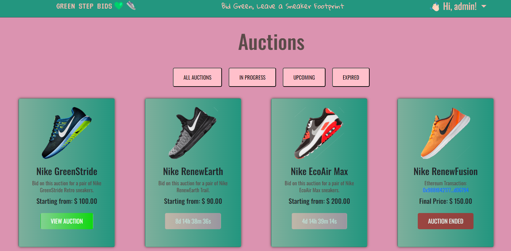
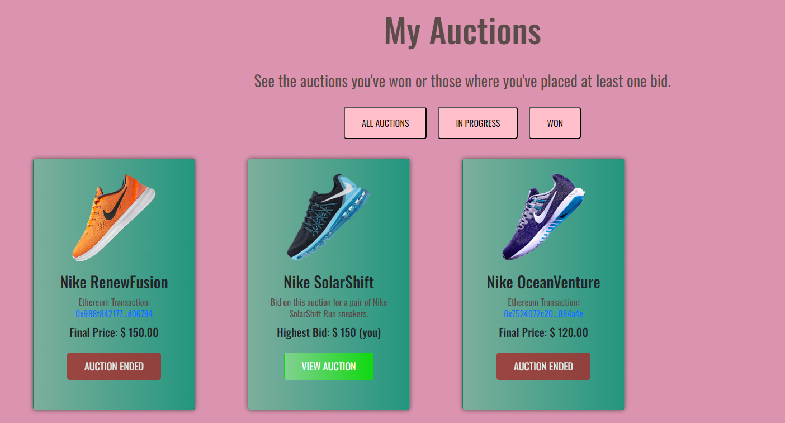

# GREEN STEP BIDS: MY FINAL START2IMPACT BLOCKCHAIN DEVELOPMENT PROJECT! 👟
Hello and welcome to my final Start2Impact Blockchain Development Project. I enjoyed this Master and wow.. what a journey has been! From not knowing even what VSCode was to build such a complex project. I'm proud of myself!

I deployed the project with Railway at https://web-production-bbee.up.railway.app/

Functionalities are explained in detail in the presentation attached to this repository.
## OVERVIEW 🌎
Welcome to GreenStepBids, a Django project for an online auction application, allowing users to participate in auctions and place bids on eco-friendly and sustainable sneakers.
At the conclusion of each auction, an automated process generates a JSON file containing comprehensive auction details, including the winning bidder's information. This JSON data is then hashed and securely transmitted to the Sepolia blockchain through a transaction.

## TECHNOLOGIES USED ⛓️
- Django
- CSS/Bootstrap
- PostgreSQL
- Redis
- Celery
- Web3.py
- Javascript
- Git

## FEATURES 🧑🏻‍💻
- SIGN UP / LOGIN PAGE (W/ RESET PASSWORD FUNCIONALITIES) 
- DJANGO MESSAGES & OTHER GRAPHICS ELEMENTS (LOADING SPINNERS, ETC.)
- AUCTIONS PAGE
- AUCTION DETAILS PAGE

- MY AUCTIONS PAGE

## WHAT HAPPENS WHEN AN AUCTION ENDS? 
When an auction expires, three Celery workers come into play. These workers are scheduled to listen to events every minute, such as the end of an auction. 

The first worker is responsible for fetching the highest bid and the winner from the Redis cache for that particular auction and then saving them in the database.
The second worker handles auctions that have concluded but have not yet been broadcasted to the Sepolia blockchain. 
It creates a JSON containing the auction data, hashes it, writes the transaction to the Sepolia blockchain and saves the tx hash to the database
The third worker activates when it detects a new Ethereum transaction has been broadcasted. In this case, to manage memory efficiently, it proceeds to clear the Redis cache (remember, Auctions are stored in the SQLite DB and Bids are stored in Redis!)  for the corresponding auction, preventing unnecessary memory consumption.

## CONTACTS
Email: diego.boost@gmail.com
Github: github.com/diegoddie
Personal Website: https://diegolauricella.netlify.app/
Fiverr: fiverr.com/diegoddie
Upwork: upwork.com/freelancers/~01021369935709b658
